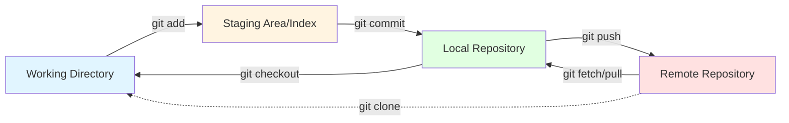
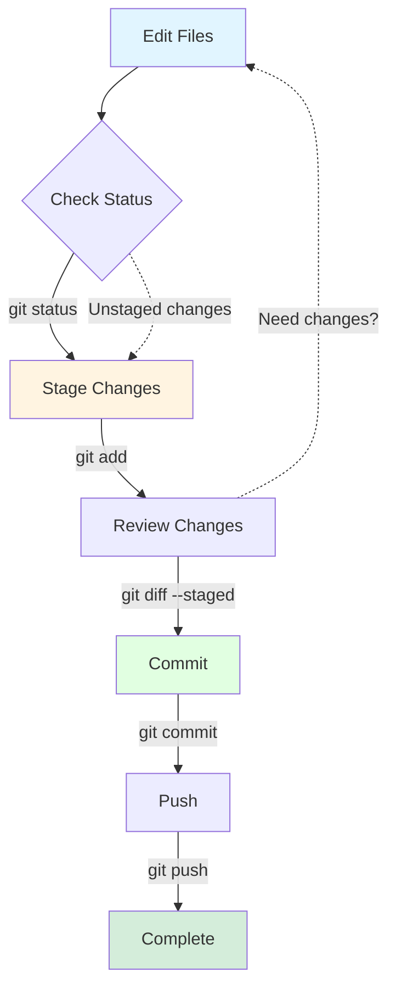
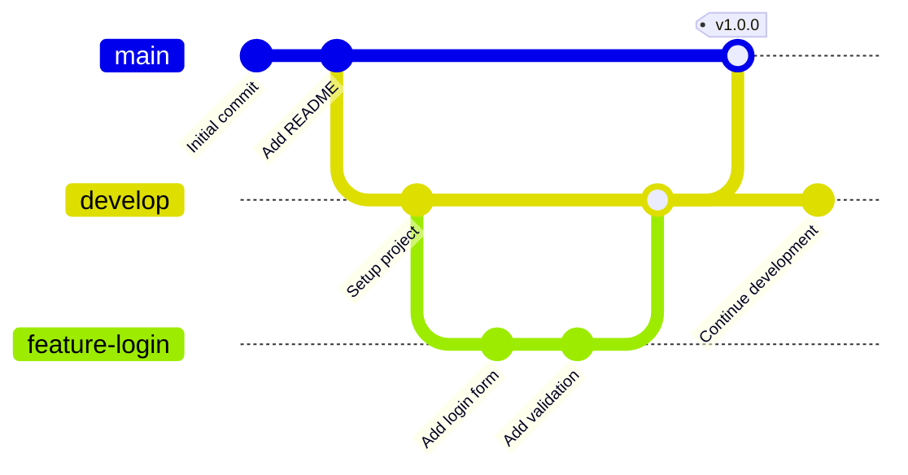

\newpage

# Git Core Commands - Essential Reference

**Version:** 1.0.0  
**Last Updated:** 2026-01-17  
**License:** MIT

## Table of Contents

1. [Git Fundamentals](#git-fundamentals)
2. [The Three States of Files](#the-three-states-of-files)
3. [Setup & Configuration](#setup--configuration)
4. [Repository Initialization](#repository-initialization)
5. [Basic Snapshotting](#basic-snapshotting)
6. [Branching Basics](#branching-basics)
7. [Merging Basics](#merging-basics)
8. [Inspection & Comparison](#inspection--comparison)
9. [Undoing Changes](#undoing-changes)
10. [Remote Repositories](#remote-repositories)
11. [Command Quick Reference](#command-quick-reference)
12. [How to Export to PDF](#how-to-export-to-pdf)

<div style="page-break-after: always;"></div>

## Git Fundamentals

Git is a distributed version control system that tracks changes in your codebase. Understanding its architecture is crucial for effective use.

### Git Architecture Flow



**Key Components:**

- 🗂️ **Working Directory**: Your local files where you make changes
- 📋 **Staging Area (Index)**: Prepares files for the next commit
- 💾 **Local Repository**: Your local Git database (.git folder)
- ☁️ **Remote Repository**: Shared repository (GitHub, GitLab, etc.)

> 💡 **Tip:** Git is distributed - every clone is a full backup of the repository history!

<div style="page-break-after: always;"></div>

## The Three States of Files

Files in Git can be in one of three states:

```
┌─────────────────────────────────────────────────────────────┐
│                    GIT FILE STATES                          │
└─────────────────────────────────────────────────────────────┘

   WORKING DIRECTORY          STAGING AREA         REPOSITORY
   ─────────────────          ────────────         ──────────
         
   ┌──────────┐              ┌──────────┐         ┌──────────┐
   │          │   git add    │          │  commit │          │
   │ Modified │─────────────▶│  Staged  │────────▶│Committed │
   │          │              │          │         │          │
   └──────────┘              └──────────┘         └──────────┘
        ▲                                              │
        │                    git checkout              │
        └──────────────────────────────────────────────┘
        
   🟡 Untracked   ───git add───▶  📝 Tracked
   🟠 Modified    ───git add───▶  🟢 Staged
   🔵 Staged      ───commit───▶   ✅ Committed
```

### State Descriptions

| State | Symbol | Description |
|-------|--------|-------------|
| **Untracked** | 🟡 | New files not yet tracked by Git |
| **Modified** | 🟠 | Changed files not yet staged |
| **Staged** | 🔵 | Files ready for the next commit |
| **Committed** | ✅ | Changes safely stored in repository |

> ⚠️ **Warning:** Modified files not staged will NOT be included in your commit!

<div style="page-break-after: always;"></div>

## Setup & Configuration

### Initial Configuration

Configure Git before your first commit:

```bash
# Set your identity (required)
git config --global user.name "Your Name"
git config --global user.email "your.email@example.com"

# Set default branch name
git config --global init.defaultBranch main

# Set default editor
git config --global core.editor "vim"
# Or for VS Code:
git config --global core.editor "code --wait"

# Enable color output
git config --global color.ui auto

# Set line ending preferences
git config --global core.autocrlf input    # Linux/Mac
git config --global core.autocrlf true     # Windows
```

### Configuration Levels

| Level | Scope | File Location | Command Flag |
|-------|-------|---------------|--------------|
| **System** | All users | `/etc/gitconfig` | `--system` |
| **Global** | Current user | `~/.gitconfig` | `--global` |
| **Local** | Current repo | `.git/config` | `--local` |

```bash
# View all configurations
git config --list

# View specific configuration
git config user.name

# Edit global config file directly
git config --global --edit
```

### SSH Setup for Remote Repositories

```bash
# Generate SSH key
ssh-keygen -t ed25519 -C "your.email@example.com"

# Start SSH agent
eval "$(ssh-agent -s)"

# Add SSH key to agent
ssh-add ~/.ssh/id_ed25519

# Copy public key to clipboard (Linux)
cat ~/.ssh/id_ed25519.pub | xclip -selection clipboard

# Test SSH connection to GitHub
ssh -T git@github.com
```

> 💡 **Tip:** Add your public key to GitHub/GitLab under Settings → SSH Keys

<div style="page-break-after: always;"></div>

## Repository Initialization

### Creating a New Repository

```bash
# Initialize a new repository
git init
git init my-project          # Create and initialize new directory

# Initialize with specific branch name
git init -b main
```

### Cloning an Existing Repository

```bash
# Clone via HTTPS
git clone https://github.com/user/repo.git

# Clone via SSH
git clone git@github.com:user/repo.git

# Clone into specific directory
git clone https://github.com/user/repo.git my-folder

# Clone specific branch
git clone -b develop https://github.com/user/repo.git

# Shallow clone (limited history)
git clone --depth 1 https://github.com/user/repo.git
```

### Initial Commit Workflow

```bash
# After git init
echo "# My Project" > README.md
git add README.md
git commit -m "Initial commit"

# Connect to remote and push
git remote add origin git@github.com:user/repo.git
git push -u origin main
```

> 📝 **Note:** The `-u` flag sets the upstream tracking branch for future pushes

<div style="page-break-after: always;"></div>

## Basic Snapshotting

### The Basic Workflow



### git status - Check Repository State

```bash
# Full status
git status

# Short format
git status -s
# Output format:
#  M modified (working directory)
# M  modified (staged)
# MM modified (staged and working directory)
# A  added (staged)
# ?? untracked

# Show branch information
git status -b
```

### git add - Stage Changes

```bash
# Stage specific file
git add filename.txt

# Stage multiple files
git add file1.txt file2.txt

# Stage all files in directory
git add .

# Stage all modified and deleted files (not new)
git add -u

# Stage all changes (modified, new, deleted)
git add -A

# Interactive staging
git add -i

# Patch mode (stage parts of files)
git add -p
```

> ⚠️ **Warning:** `git add .` stages everything in current directory and subdirectories!

### git diff - View Changes

```bash
# Show unstaged changes
git diff

# Show staged changes
git diff --staged
git diff --cached        # Same as --staged

# Compare specific file
git diff filename.txt

# Compare branches
git diff main..feature

# Show word-level diff
git diff --word-diff

# Show statistics only
git diff --stat
```

### git commit - Save Changes

```bash
# Commit with inline message
git commit -m "Add user authentication feature"

# Commit with editor for longer message
git commit

# Stage all tracked files and commit
git commit -am "Update documentation"

# Amend last commit (change message or add files)
git commit --amend

# Amend without changing message
git commit --amend --no-edit

# Empty commit (for CI triggers)
git commit --allow-empty -m "Trigger CI"
```

**Commit Message Best Practices:**

```
<type>: <subject>

<body>

<footer>
```

Types: `feat`, `fix`, `docs`, `style`, `refactor`, `test`, `chore`

Example:
```
feat: Add user authentication with JWT

- Implement login and registration endpoints
- Add JWT token generation and validation
- Create middleware for protected routes

Closes #123
```

### git rm - Remove Files

```bash
# Remove file from working directory and staging area
git rm filename.txt

# Remove only from staging area (keep in working directory)
git rm --cached filename.txt

# Remove directory recursively
git rm -r directory/

# Force removal (if file is modified)
git rm -f filename.txt
```

### git mv - Move/Rename Files

```bash
# Rename file
git mv oldname.txt newname.txt

# Move file to directory
git mv file.txt directory/

# Equivalent to:
# mv oldname.txt newname.txt
# git rm oldname.txt
# git add newname.txt
```

> 💡 **Tip:** Git automatically detects renames with >50% similarity

<div style="page-break-after: always;"></div>

## Branching Basics

Branches allow parallel development without affecting the main codebase.

### Branch Visualization



### git branch - Manage Branches

```bash
# List all local branches
git branch

# List all branches (local + remote)
git branch -a

# List remote branches only
git branch -r

# Create new branch
git branch feature-login

# Create branch from specific commit
git branch hotfix abc1234

# Delete branch (safe - prevents deleting unmerged)
git branch -d feature-login

# Force delete branch (even if unmerged)
git branch -D feature-login

# Rename current branch
git branch -m new-branch-name

# Rename other branch
git branch -m old-name new-name

# Show branches with last commit
git branch -v

# Show merged branches
git branch --merged

# Show unmerged branches
git branch --no-merged
```

### git checkout - Switch Branches (Legacy)

```bash
# Switch to existing branch
git checkout develop

# Create and switch to new branch
git checkout -b feature-new

# Create branch from specific starting point
git checkout -b hotfix main

# Switch to previous branch
git checkout -

# Checkout specific file from branch
git checkout main -- filename.txt
```

### git switch - Switch Branches (Modern)

```bash
# Switch to existing branch
git switch develop

# Create and switch to new branch
git switch -c feature-new
git switch --create feature-new

# Switch to previous branch
git switch -

# Discard local changes when switching
git switch -f develop
```

### git restore - Restore Files (Modern)

```bash
# Discard changes in working directory
git restore filename.txt

# Restore all files
git restore .

# Unstage file (remove from staging area)
git restore --staged filename.txt

# Restore file from specific commit
git restore --source=abc1234 filename.txt

# Restore file from another branch
git restore --source=main filename.txt
```

> 💡 **Tip:** `git switch` and `git restore` are modern alternatives that split `git checkout`'s functionality

**Safety Levels:**

- 🟢 **Safe:** `git branch`, `git switch` (without -f)
- 🟡 **Caution:** `git restore`, `git switch -f`
- 🔴 **Dangerous:** `git branch -D`

<div style="page-break-after: always;"></div>

## Merging Basics

### Merge Types

#### Fast-Forward Merge

When target branch has no new commits:

```
Before:              After:
main:    A---B       main:    A---B---C---D
              \                            
feature:       C---D  feature:            
```

```bash
git checkout main
git merge feature      # Fast-forward merge
```

#### 3-Way Merge

When both branches have new commits:

```
Before:              After:
main:    A---B---E   main:    A---B---E---M
              \                          / \
feature:       C---D  feature:     C---D
```

```bash
git checkout main
git merge feature      # Creates merge commit M
```

### git merge Commands

```bash
# Merge branch into current branch
git merge feature-login

# Merge without fast-forward (always create merge commit)
git merge --no-ff feature-login

# Merge with custom message
git merge feature-login -m "Merge feature-login into main"

# Abort merge in case of conflicts
git merge --abort

# Continue merge after resolving conflicts
git merge --continue

# Show merge status
git status
```

### Conflict Resolution

When Git cannot automatically merge:

```bash
# 1. View conflicts
git status

# 2. Open conflicted files
# Look for conflict markers:
<<<<<<< HEAD
Current branch content
=======
Incoming branch content
>>>>>>> feature-branch

# 3. Resolve conflicts manually
# Edit file, remove markers, keep desired content

# 4. Stage resolved files
git add resolved-file.txt

# 5. Complete the merge
git commit
# Or:
git merge --continue
```

**Conflict Resolution Tools:**

```bash
# Use merge tool
git mergetool

# View different versions
git show :1:filename.txt   # Common ancestor
git show :2:filename.txt   # Current branch (ours)
git show :3:filename.txt   # Incoming branch (theirs)

# Accept ours or theirs
git checkout --ours filename.txt
git checkout --theirs filename.txt
```

> ⚠️ **Warning:** Always test after resolving conflicts!

### Merge Strategies

```bash
# Recursive (default for 2 branches)
git merge -s recursive feature

# Ours (always prefer current branch)
git merge -s ours feature

# Theirs (prefer incoming branch when conflicts)
git merge -X theirs feature

# Patience (better for complex conflicts)
git merge -X patience feature
```

> 💡 **Tip:** Use `--no-ff` to preserve branch history even for fast-forward merges

<div style="page-break-after: always;"></div>

## Inspection & Comparison

### git log - View Commit History

```bash
# Basic log
git log

# One line per commit
git log --oneline

# Show with graph
git log --oneline --graph --all

# Limit number of commits
git log -n 5
git log -5

# Show commits by author
git log --author="John Doe"

# Show commits in date range
git log --since="2 weeks ago"
git log --after="2024-01-01" --before="2024-12-31"

# Show commits affecting specific file
git log filename.txt
git log --follow filename.txt     # Follow renames

# Show commits with diffs
git log -p
git log --patch

# Show statistics
git log --stat

# Show commits in pretty format
git log --pretty=format:"%h - %an, %ar : %s"

# Search commit messages
git log --grep="bug fix"

# Search code changes
git log -S "function_name"

# Show merge commits only
git log --merges

# Show no merge commits
git log --no-merges
```

### Custom Log Formats

```bash
# Detailed format
git log --pretty=format:"%C(yellow)%h%Creset %C(cyan)%ad%Creset | %s %C(green)(%an)%Creset" --date=short

# Create alias for custom format
git config --global alias.lg "log --color --graph --pretty=format:'%Cred%h%Creset -%C(yellow)%d%Creset %s %Cgreen(%cr) %C(bold blue)<%an>%Creset' --abbrev-commit"

# Use alias
git lg
```

**Format Placeholders:**

| Placeholder | Description |
|-------------|-------------|
| `%H` | Commit hash (full) |
| `%h` | Commit hash (abbreviated) |
| `%an` | Author name |
| `%ae` | Author email |
| `%ad` | Author date |
| `%ar` | Author date (relative) |
| `%s` | Subject (commit message) |
| `%b` | Body (commit message) |
| `%d` | Ref names (branches, tags) |

### git show - Show Commits and Objects

```bash
# Show latest commit
git show

# Show specific commit
git show abc1234

# Show specific file from commit
git show abc1234:path/to/file.txt

# Show commit statistics
git show --stat abc1234

# Show tag information
git show v1.0.0

# Show specific object
git show HEAD~3              # 3 commits before HEAD
git show main@{yesterday}    # main branch yesterday
```

### git reflog - Reference Logs

```bash
# Show all reference updates
git reflog

# Show for specific branch
git reflog show main

# Find lost commits
git reflog
git show abc1234
git checkout -b recovery abc1234
```

> 💡 **Tip:** `git reflog` can save you from accidental deletions!

<div style="page-break-after: always;"></div>

## Undoing Changes

### Decision Tree for Undoing Changes

```
┌────────────────────────────────────────────────────────┐
│         WHICH UNDO COMMAND SHOULD I USE?               │
└────────────────────────────────────────────────────────┘

         Did you commit yet?
                │
        ┌───────┴───────┐
       NO              YES
        │                │
        │          Do you want to keep history?
        │                │
        │        ┌───────┴────────┐
        │       YES               NO
        │        │                 │
        │   git revert        Pushed to remote?
        │                          │
        │                  ┌───────┴────────┐
        │                 YES               NO
        │                  │                 │
        │             DON'T DO IT      git reset
        │                  │
   Is it staged?           │
        │            (or use git revert)
    ┌───┴────┐
   YES       NO
    │         │
git restore  git restore
  --staged   (working dir)
```

### git restore - Discard Changes (🟢 Safe)

```bash
# Discard changes in working directory
git restore filename.txt
git restore .                    # All files

# Unstage file
git restore --staged filename.txt

# Restore from specific source
git restore --source=HEAD~2 filename.txt
git restore --source=main filename.txt
```

### git reset - Move Branch Pointer (🟡🔴 Caution/Dangerous)

#### Reset Modes Comparison

| Mode | HEAD | Index (Staging) | Working Dir | Safety |
|------|------|-----------------|-------------|--------|
| `--soft` | ✅ Moved | ❌ Unchanged | ❌ Unchanged | 🟢 Safe |
| `--mixed` (default) | ✅ Moved | ✅ Reset | ❌ Unchanged | 🟡 Caution |
| `--hard` | ✅ Moved | ✅ Reset | ✅ Reset | 🔴 Dangerous |

```bash
# Soft reset (keep changes staged)
git reset --soft HEAD~1          # Undo last commit, keep changes staged

# Mixed reset (unstage changes)
git reset HEAD~1                 # Undo last commit, unstage changes
git reset --mixed HEAD~1         # Same as above

# Hard reset (discard all changes)
git reset --hard HEAD~1          # ⛔ Undo last commit, discard changes
git reset --hard origin/main     # ⛔ Match remote branch exactly

# Unstage specific file
git reset HEAD filename.txt

# Reset to specific commit
git reset --hard abc1234         # ⛔ Move to commit abc1234
```

> ⛔ **DANGER:** `git reset --hard` permanently deletes uncommitted changes!

> ⚠️ **Warning:** Never reset commits that have been pushed to a shared repository!

### git revert - Create Inverse Commit (🟢 Safe)

```bash
# Revert last commit (creates new commit)
git revert HEAD

# Revert specific commit
git revert abc1234

# Revert without committing
git revert --no-commit abc1234
git revert -n abc1234

# Revert merge commit
git revert -m 1 merge-commit-hash

# Revert range of commits
git revert HEAD~3..HEAD
```

**git reset vs git revert:**

| Aspect | git reset | git revert |
|--------|-----------|------------|
| **History** | Rewrites history | Preserves history |
| **Safety** | 🔴 Can lose work | 🟢 Safe |
| **Collaboration** | ⛔ Bad for shared branches | ✅ Good for shared branches |
| **Result** | Moves branch pointer | Creates new commit |
| **When to use** | Local changes only | Public/shared branches |

### git clean - Remove Untracked Files (🔴 Dangerous)

```bash
# Show what would be deleted (dry run)
git clean -n
git clean --dry-run

# Remove untracked files
git clean -f

# Remove untracked files and directories
git clean -fd

# Remove ignored files too
git clean -fdx

# Interactive mode
git clean -i
```

> ⛔ **DANGER:** `git clean` permanently deletes files!

<div style="page-break-after: always;"></div>

## Remote Repositories

### Remote Repository Architecture

```
┌─────────────────────────────────────────────────────────┐
│               REMOTE REPOSITORY TRACKING                │
└─────────────────────────────────────────────────────────┘

Remote (GitHub/GitLab)
    origin/main
        ↓
    git fetch
        ↓
Local Remote-Tracking Branch
    origin/main (read-only)
        ↓
    git merge origin/main
        ↓
Local Branch
    main (read-write)
        ↓
Working Directory
```

### git remote - Manage Remotes

```bash
# List remotes
git remote
git remote -v                    # Show URLs

# Add remote
git remote add origin https://github.com/user/repo.git

# Add additional remote
git remote add upstream https://github.com/original/repo.git

# Show remote details
git remote show origin

# Rename remote
git remote rename origin upstream

# Remove remote
git remote remove origin

# Change remote URL
git remote set-url origin git@github.com:user/repo.git

# List remote branches
git remote show origin
```

### git fetch - Download Remote Changes (🟢 Safe)

```bash
# Fetch all remotes
git fetch

# Fetch specific remote
git fetch origin

# Fetch specific branch
git fetch origin main

# Fetch all branches and tags
git fetch --all

# Fetch and prune deleted remote branches
git fetch --prune
git fetch -p

# Fetch tags
git fetch --tags
```

> 💡 **Tip:** `git fetch` is safe - it downloads but doesn't modify your working files

### git pull - Fetch and Merge (🟡 Caution)

```bash
# Pull from tracking branch
git pull

# Pull from specific remote and branch
git pull origin main

# Pull with rebase instead of merge
git pull --rebase
git pull -r

# Pull and update submodules
git pull --recurse-submodules

# Pull with fast-forward only (fail if merge needed)
git pull --ff-only
```

**git pull = git fetch + git merge:**

```bash
# These are equivalent:
git pull origin main

git fetch origin
git merge origin/main
```

### git push - Upload Local Changes (🟡 Caution)

```bash
# Push to tracking branch
git push

# Push to specific remote and branch
git push origin main

# Push and set upstream tracking
git push -u origin main
git push --set-upstream origin main

# Push all branches
git push --all

# Push tags
git push --tags

# Push specific tag
git push origin v1.0.0

# Delete remote branch
git push origin --delete feature-branch
git push origin :feature-branch    # Old syntax

# Force push (⚠️ DANGEROUS)
git push --force
git push -f

# Force push with lease (safer)
git push --force-with-lease
```

> ⛔ **DANGER:** `git push --force` can overwrite others' work!

> 💡 **Tip:** Use `--force-with-lease` instead of `--force` for safer force pushing

### Tracking Branches

```bash
# Set upstream branch for current branch
git branch --set-upstream-to=origin/main
git branch -u origin/main

# Show tracking branches
git branch -vv

# Create branch and track remote
git checkout -b feature origin/feature
git switch -c feature origin/feature

# Track remote branch with same name
git checkout --track origin/feature
```

### Common Remote Workflows

**Fork and Pull Request Workflow:**

```bash
# 1. Fork repository on GitHub
# 2. Clone your fork
git clone git@github.com:youruser/repo.git
cd repo

# 3. Add upstream remote
git remote add upstream git@github.com:original/repo.git

# 4. Create feature branch
git switch -c feature-name

# 5. Make changes and commit
git add .
git commit -m "Add feature"

# 6. Keep up to date with upstream
git fetch upstream
git rebase upstream/main

# 7. Push to your fork
git push -u origin feature-name

# 8. Create Pull Request on GitHub
```

**Syncing Fork with Upstream:**

```bash
# Fetch upstream changes
git fetch upstream

# Switch to main branch
git switch main

# Merge upstream changes
git merge upstream/main

# Or rebase
git rebase upstream/main

# Push to your fork
git push origin main
```

<div style="page-break-after: always;"></div>

## Command Quick Reference

### Configuration

| Command | Description | Safety |
|---------|-------------|--------|
| `git config --global user.name "Name"` | Set username | 🟢 |
| `git config --global user.email "email"` | Set email | 🟢 |
| `git config --list` | List all settings | 🟢 |

### Repository Setup

| Command | Description | Safety |
|---------|-------------|--------|
| `git init` | Initialize repository | 🟢 |
| `git clone <url>` | Clone repository | 🟢 |

### Basic Snapshotting

| Command | Description | Safety |
|---------|-------------|--------|
| `git status` | Show working tree status | 🟢 |
| `git add <file>` | Stage changes | 🟢 |
| `git add .` | Stage all changes | 🟢 |
| `git diff` | Show unstaged changes | 🟢 |
| `git diff --staged` | Show staged changes | 🟢 |
| `git commit -m "message"` | Commit staged changes | 🟢 |
| `git commit -am "message"` | Stage and commit tracked files | 🟢 |
| `git rm <file>` | Remove file | 🟡 |
| `git mv <old> <new>` | Move/rename file | 🟢 |

### Branching

| Command | Description | Safety |
|---------|-------------|--------|
| `git branch` | List branches | 🟢 |
| `git branch <name>` | Create branch | 🟢 |
| `git branch -d <name>` | Delete branch (safe) | 🟢 |
| `git branch -D <name>` | Force delete branch | 🔴 |
| `git switch <branch>` | Switch to branch | 🟢 |
| `git switch -c <branch>` | Create and switch to branch | 🟢 |
| `git checkout <branch>` | Switch to branch (legacy) | 🟢 |
| `git checkout -b <branch>` | Create and switch (legacy) | 🟢 |

### Merging

| Command | Description | Safety |
|---------|-------------|--------|
| `git merge <branch>` | Merge branch | 🟡 |
| `git merge --no-ff <branch>` | Merge without fast-forward | 🟡 |
| `git merge --abort` | Abort merge | 🟢 |

### Inspection

| Command | Description | Safety |
|---------|-------------|--------|
| `git log` | Show commit history | 🟢 |
| `git log --oneline` | Compact log | 🟢 |
| `git log --graph --all` | Visual branch history | 🟢 |
| `git show <commit>` | Show commit details | 🟢 |
| `git reflog` | Show reference log | 🟢 |

### Undoing Changes

| Command | Description | Safety |
|---------|-------------|--------|
| `git restore <file>` | Discard working changes | 🟡 |
| `git restore --staged <file>` | Unstage file | 🟢 |
| `git reset HEAD~1` | Undo last commit (keep changes) | 🟡 |
| `git reset --soft HEAD~1` | Undo commit (keep staged) | 🟢 |
| `git reset --hard HEAD~1` | Undo commit (discard changes) | 🔴 |
| `git revert <commit>` | Create inverse commit | 🟢 |
| `git clean -fd` | Remove untracked files | 🔴 |

### Remote Repositories

| Command | Description | Safety |
|---------|-------------|--------|
| `git remote -v` | List remotes | 🟢 |
| `git remote add <name> <url>` | Add remote | 🟢 |
| `git fetch` | Download remote changes | 🟢 |
| `git pull` | Fetch and merge | 🟡 |
| `git pull --rebase` | Fetch and rebase | 🟡 |
| `git push` | Upload changes | 🟡 |
| `git push -u origin <branch>` | Push and set upstream | 🟡 |
| `git push --force-with-lease` | Safer force push | 🔴 |

### Safety Legend

- 🟢 **Safe:** No risk of data loss
- 🟡 **Caution:** May cause issues if used incorrectly
- 🔴 **Dangerous:** Can cause permanent data loss
- ⛔ **Critical:** Use with extreme caution

<div style="page-break-after: always;"></div>

## How to Export to PDF

This cheat sheet is designed to be exported to PDF. Here are several methods:

### Method 1: Using Pandoc (Recommended)

```bash
# Install pandoc and LaTeX
sudo apt-get install pandoc texlive-latex-base texlive-fonts-recommended

# Convert to PDF
pandoc git-core-commands.md -o git-core-commands.pdf \
  --from markdown \
  --template eisvogel \
  --listings \
  --pdf-engine=pdflatex

# Or use the YAML front matter settings
pandoc git-core-commands.md -o git-core-commands.pdf
```

### Method 2: Using VS Code Extensions

1. Install **Markdown PDF** extension by yzane
2. Open this file in VS Code
3. Press `Ctrl+Shift+P` (or `Cmd+Shift+P` on Mac)
4. Type "Markdown PDF: Export (pdf)"
5. Select the output location

### Method 3: Using Grip + Print to PDF

```bash
# Install grip
pip install grip

# Render markdown with GitHub styles
grip git-core-commands.md

# Open http://localhost:6419 in browser
# Use browser's Print → Save as PDF
```

### Method 4: Using Node.js markdown-pdf

```bash
# Install markdown-pdf
npm install -g markdown-pdf

# Convert to PDF
markdown-pdf git-core-commands.md -o git-core-commands.pdf
```

### Method 5: Online Converters

- **Markdown to PDF**: https://www.markdowntopdf.com/
- **CloudConvert**: https://cloudconvert.com/md-to-pdf
- **Dillinger**: https://dillinger.io/ (export as PDF)

### Recommended Pandoc Template

For better PDF output, install the Eisvogel template:

```bash
# Download template
wget https://raw.githubusercontent.com/Wandmalfarbe/pandoc-latex-template/master/eisvogel.tex

# Move to pandoc templates directory
mkdir -p ~/.pandoc/templates
mv eisvogel.tex ~/.pandoc/templates/

# Use with pandoc
pandoc git-core-commands.md -o git-core-commands.pdf --template eisvogel
```

> 💡 **Tip:** The YAML front matter at the top of this file contains PDF export settings

---

## Additional Resources

**Official Documentation:**
- Git Official: https://git-scm.com/doc
- Git Book: https://git-scm.com/book/en/v2
- GitHub Docs: https://docs.github.com

**Interactive Learning:**
- Learn Git Branching: https://learngitbranching.js.org/
- Git Immersion: https://gitimmersion.com/
- Visualizing Git: http://git-school.github.io/visualizing-git/

**Cheat Sheets:**
- GitHub Git Cheat Sheet: https://education.github.com/git-cheat-sheet-education.pdf
- Atlassian Git Tutorials: https://www.atlassian.com/git/tutorials

---

**Document Information:**

- **Version:** 1.0.0
- **Last Updated:** 2026-01-17
- **Author:** Data Engineering Team
- **License:** MIT
- **Repository:** https://github.com/user/Data-Engineering

---

*End of Git Core Commands Cheat Sheet*
