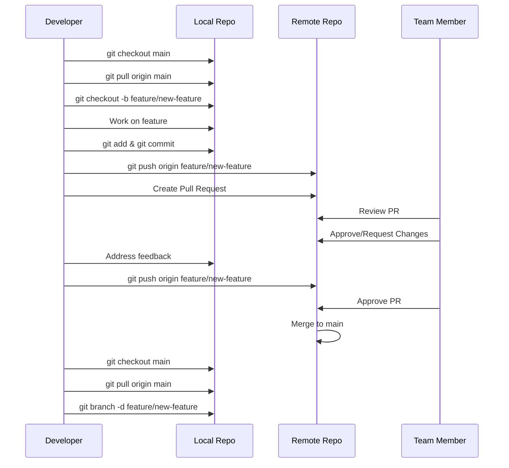
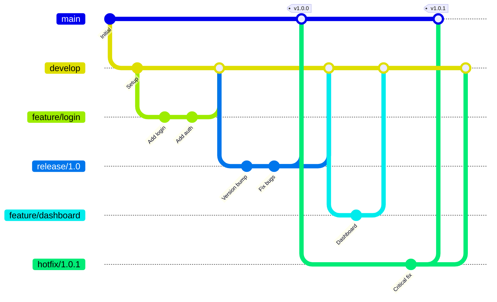
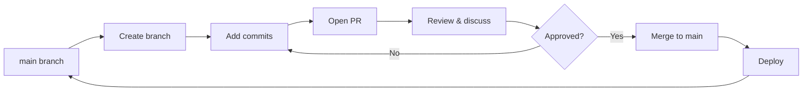
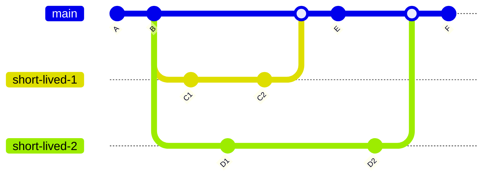
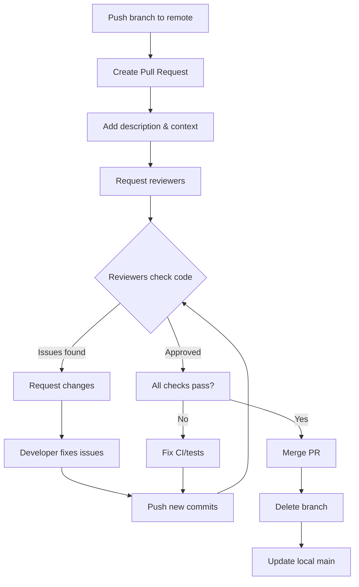
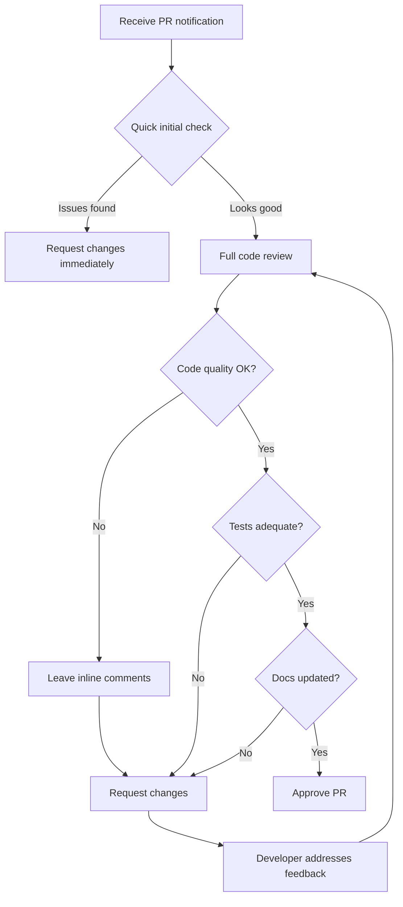

\newpage

# Git Team Workflows - Collaboration Best Practices

**Version:** 1.0.0  
**Date:** January 17, 2026  
**Purpose:** Comprehensive guide for team-based Git workflows and collaboration

---

## Table of Contents

1. [Team Collaboration Overview](#team-collaboration-overview)
2. [Daily Workflow Checklist](#daily-workflow-checklist)
3. [Feature Branch Workflow](#feature-branch-workflow)
4. [Git Flow Workflow](#git-flow-workflow)
5. [GitHub Flow](#github-flow)
6. [Trunk-Based Development](#trunk-based-development)
7. [Common Team Scenarios](#common-team-scenarios)
8. [Pull Request Best Practices](#pull-request-best-practices)
9. [Commit Message Guidelines](#commit-message-guidelines)
10. [Branch Naming Conventions](#branch-naming-conventions)
11. [.gitignore for Teams](#gitignore-for-teams)
12. [Communication & Etiquette](#communication-etiquette)
13. [Troubleshooting Common Team Issues](#troubleshooting-common-team-issues)
14. [How to Export to PDF](#how-to-export-to-pdf)

\newpage

## 🤝 Team Collaboration Overview

### Git in Team Environments

```
┌─────────────┐
│   Remote    │ ◄─── Central source of truth
│ Repository  │      (GitHub/GitLab/Bitbucket)
└──────┬──────┘
       │
   ┌───┴────┬────────┬────────┐
   │        │        │        │
┌──▼───┐ ┌──▼───┐ ┌──▼───┐ ┌──▼───┐
│Dev 1 │ │Dev 2 │ │Dev 3 │ │Dev 4 │
└──────┘ └──────┘ └──────┘ └──────┘
Local      Local    Local    Local
Repos      Repos    Repos    Repos
```

### Key Team Principles

- 🔒 **Never force push to shared branches** (main, develop, etc.)
- 💬 **Communicate before rebasing shared branches**
- 🔄 **Pull frequently** to stay synchronized
- ✅ **Use Pull Requests** for code review
- 🏷️ **Follow naming conventions** for clarity
- 📝 **Write meaningful commit messages**

> **💡 Tip:** Establish team conventions early and document them in CONTRIBUTING.md

\newpage

## ✅ Daily Workflow Checklist

### 🌅 Morning Routine

- [ ] `git fetch origin` - Check for remote changes
- [ ] `git status` - Check current branch and state
- [ ] `git pull origin main` - Update main branch
- [ ] Review team notifications and PR comments
- [ ] Check project board for assigned tasks

### 💻 During Work

- [ ] Create feature branch: `git checkout -b feature/task-name`
- [ ] Commit frequently with clear messages
- [ ] Push work-in-progress: `git push -u origin feature/task-name`
- [ ] Sync with main periodically: `git fetch origin && git merge origin/main`
- [ ] Respond to PR reviews promptly

### 🌙 End of Day

- [ ] Commit all work: `git add . && git commit -m "WIP: description"`
- [ ] Push to remote: `git push origin feature/task-name`
- [ ] Update task status on project board
- [ ] Create/update PR if feature is ready for review
- [ ] Leave comments on team PRs

> **⚠️ Warning:** Never leave uncommitted work overnight - you might lose it!

\newpage

## 🌿 Feature Branch Workflow

### Complete Sequence Diagram



### Step-by-Step Commands

```bash
# 1. Start from updated main
git checkout main
git pull origin main

# 2. Create feature branch
git checkout -b feature/user-authentication

# 3. Work on feature (repeat as needed)
# ... make changes ...
git add .
git commit -m "feat: add login endpoint"

# 4. Push to remote
git push -u origin feature/user-authentication

# 5. Keep branch updated (while working)
git fetch origin
git merge origin/main
# OR use rebase (if no conflicts expected)
git rebase origin/main

# 6. Create Pull Request on GitHub/GitLab
# Use web interface to create PR

# 7. After PR is merged
git checkout main
git pull origin main
git branch -d feature/user-authentication
git push origin --delete feature/user-authentication
```

> **📦 Best Practice:** Keep feature branches short-lived (1-3 days max)

\newpage

## 🌊 Git Flow Workflow

### Comprehensive Branch Structure



### Branch Types & Purposes

| Branch Type | Purpose | Base Branch | Merge To | Lifetime |
|-------------|---------|-------------|----------|----------|
| `main` | Production code | - | - | Permanent |
| `develop` | Integration branch | `main` | - | Permanent |
| `feature/*` | New features | `develop` | `develop` | Short-lived |
| `release/*` | Release preparation | `develop` | `main` + `develop` | Short-lived |
| `hotfix/*` | Emergency fixes | `main` | `main` + `develop` | Very short |

### Git Flow Commands

```bash
# Initialize Git Flow (if using git-flow extension)
git flow init

# Feature development
git flow feature start user-profile
# ... work on feature ...
git flow feature finish user-profile

# Release preparation
git flow release start 1.2.0
# ... version bumps, minor fixes ...
git flow release finish 1.2.0

# Hotfix (emergency)
git flow hotfix start critical-security-fix
# ... fix the issue ...
git flow hotfix finish critical-security-fix
```

### Manual Git Flow Commands

```bash
# Feature branch
git checkout develop
git checkout -b feature/payment-gateway
# ... work ...
git checkout develop
git merge --no-ff feature/payment-gateway
git branch -d feature/payment-gateway

# Release branch
git checkout develop
git checkout -b release/2.0.0
# ... prepare release ...
git checkout main
git merge --no-ff release/2.0.0
git tag -a v2.0.0 -m "Release version 2.0.0"
git checkout develop
git merge --no-ff release/2.0.0
git branch -d release/2.0.0

# Hotfix branch
git checkout main
git checkout -b hotfix/security-patch
# ... fix issue ...
git checkout main
git merge --no-ff hotfix/security-patch
git tag -a v2.0.1 -m "Security hotfix"
git checkout develop
git merge --no-ff hotfix/security-patch
git branch -d hotfix/security-patch
```

> **🎯 When to Use:** Large projects with scheduled releases and multiple versions in production

\newpage

## 🚀 GitHub Flow

### Simplified Workflow



### GitHub Flow Process

```bash
# 1. Create branch from main
git checkout main
git pull origin main
git checkout -b feature/add-api-endpoint

# 2. Make changes and commit
git add .
git commit -m "feat: add user search API endpoint"
git push -u origin feature/add-api-endpoint

# 3. Open Pull Request on GitHub
# - Add description and context
# - Request reviewers
# - Link related issues

# 4. Discuss and review code
# - Address feedback
# - Push additional commits
git commit -m "refactor: improve error handling"
git push origin feature/add-api-endpoint

# 5. Merge when approved
# - Use GitHub merge button
# - Delete branch after merge

# 6. Update local repository
git checkout main
git pull origin main
```

### Pull Request Process

```
┌─────────────────────────────────────┐
│  1. Create PR with description      │
└────────────┬────────────────────────┘
             │
┌────────────▼────────────────────────┐
│  2. Automated checks run (CI/CD)    │
└────────────┬────────────────────────┘
             │
┌────────────▼────────────────────────┐
│  3. Team reviews code               │
└────────────┬────────────────────────┘
             │
         ┌───┴───┐
         │Changes│
         │needed?│
         └───┬───┘
         Yes │   No
             │   │
    ┌────────▼   ▼────────┐
    │ Make changes │ Merge │
    └────────┬─────┴───────┘
             │
    ┌────────▼────────────────────────┐
    │  4. Push updates & re-review    │
    └─────────────────────────────────┘
```

> **🎯 When to Use:** Teams that deploy frequently (continuous deployment)

\newpage

## 🌳 Trunk-Based Development

### Workflow Visualization



### Key Principles

- ✅ **Short-lived branches** (< 1 day)
- ✅ **Frequent integration** to main/trunk
- ✅ **Feature flags** for incomplete features
- ✅ **Automated testing** before merge
- ✅ **Small, incremental changes**

### Commands

```bash
# 1. Create very short-lived branch
git checkout main
git pull origin main
git checkout -b quick-fix-123

# 2. Make small, focused change
# ... edit files ...
git add .
git commit -m "fix: correct validation logic"

# 3. Immediately integrate
git push origin quick-fix-123
# Create PR and merge same day

# 4. Clean up
git checkout main
git pull origin main
git branch -d quick-fix-123
```

### Using Feature Flags

```javascript
// Example: Feature flag for incomplete feature
if (featureFlags.newDashboard) {
  renderNewDashboard();
} else {
  renderOldDashboard();
}
```

> **🎯 When to Use:** High-performing teams with strong CI/CD and testing

\newpage

## 🎬 Common Team Scenarios

### Scenario 1: Starting New Feature

```bash
# Step 1: Ensure you're on main and updated
git checkout main
git pull origin main

# Step 2: Create descriptive feature branch
git checkout -b feature/add-payment-processing

# Step 3: Make first commit
# ... create files ...
git add .
git commit -m "feat: initialize payment module structure"

# Step 4: Push and set upstream
git push -u origin feature/add-payment-processing

# Step 5: Continue working
# ... make changes ...
git add .
git commit -m "feat: add Stripe integration"
git push  # upstream already set
```

---

### Scenario 2: Getting Latest Changes

#### Option A: Pull (Fetch + Merge)

```bash
git checkout main
git pull origin main
# Creates merge commit if diverged
```

#### Option B: Fetch + Merge (More Control)

```bash
git fetch origin
git status  # Check what's different
git merge origin/main
```

#### Option C: Rebase (Clean History)

```bash
git fetch origin
git rebase origin/main
# Replays your commits on top of latest main
```

**Decision Matrix:**

| Situation | Recommended Approach |
|-----------|---------------------|
| Shared branch (main/develop) | Pull or Fetch+Merge |
| Your feature branch, no team | Rebase |
| Your feature branch, with team | Pull (safer) |
| Want clean history | Rebase (before PR) |

> **⚠️ Warning:** Never rebase commits that have been pushed and others may have pulled!

---

### Scenario 3: Resolving Merge Conflicts

```bash
# Step 1: Attempt merge/pull
git pull origin main
# Output: CONFLICT (content): Merge conflict in app.js

# Step 2: Check conflict status
git status
# Shows conflicted files in red

# Step 3: Open conflicted file
# Look for conflict markers:
# <<<<<<< HEAD
# Your changes
# =======
# Their changes
# >>>>>>> origin/main

# Step 4: Resolve conflicts manually
# Edit file to keep desired changes
# Remove conflict markers

# Step 5: Stage resolved files
git add app.js

# Step 6: Complete merge
git commit -m "merge: resolve conflicts in app.js"

# Step 7: Push resolved changes
git push origin feature/your-branch
```

#### Visual Conflict Resolution

```
Before:                    After Resolution:
<<<<<<< HEAD              
const port = 3000;        const port = process.env.PORT || 3000;
=======                   
const port = 8080;        
>>>>>>> origin/main       
```

> **💡 Tip:** Use `git mergetool` to launch visual diff tool (VS Code, Meld, etc.)

---

### Scenario 4: Code Review Process



#### Code Review Commands

```bash
# Reviewer: Check out PR branch to test locally
git fetch origin
git checkout -b review-feature origin/feature/new-feature
# ... test locally ...
git checkout main  # return to main

# Author: Address review comments
git checkout feature/new-feature
# ... make changes ...
git add .
git commit -m "refactor: address review comments"
git push origin feature/new-feature

# After PR merged
git checkout main
git pull origin main
git branch -d feature/new-feature
```

---

### Scenario 5: Hotfix in Production

**Emergency Workflow:**

```bash
# Step 1: Create hotfix from main
git checkout main
git pull origin main
git checkout -b hotfix/critical-bug-fix

# Step 2: Fix the issue (minimal changes)
# ... fix bug ...
git add .
git commit -m "hotfix: resolve null pointer in auth"

# Step 3: Push and create URGENT PR
git push -u origin hotfix/critical-bug-fix
# Create PR with [URGENT] prefix

# Step 4: Fast-track review and merge
# Get immediate review from senior developer

# Step 5: Verify fix in production
# Deploy and monitor

# Step 6: Backport to develop (Git Flow)
git checkout develop
git pull origin develop
git merge hotfix/critical-bug-fix
git push origin develop

# Step 7: Clean up
git branch -d hotfix/critical-bug-fix
```

> **🚨 Critical:** Always have a senior developer review hotfixes before deployment

---

### Scenario 6: Syncing Fork with Upstream

```bash
# Step 1: Add upstream remote (one-time setup)
git remote add upstream https://github.com/original/repo.git
git remote -v  # Verify remotes

# Step 2: Fetch upstream changes
git fetch upstream

# Step 3: Checkout main and merge upstream
git checkout main
git merge upstream/main

# Step 4: Push to your fork
git push origin main

# Step 5: Update your feature branch
git checkout feature/your-feature
git merge main  # or git rebase main
git push origin feature/your-feature
```

\newpage

## 🔍 Pull Request Best Practices

### PR Checklist

- [ ] **Title is clear** and follows convention (feat/fix/docs)
- [ ] **Description explains WHY** (not just what)
- [ ] **Links related issues** (#123)
- [ ] **Self-reviewed** the code diff
- [ ] **Tests added/updated** for changes
- [ ] **Documentation updated** if needed
- [ ] **No merge conflicts** with base branch
- [ ] **CI/CD checks passing**
- [ ] **Appropriate reviewers** assigned
- [ ] **Small scope** (< 400 lines changed)

### PR Description Template

```markdown
## Description
Brief description of changes

## Motivation and Context
Why is this change needed? What problem does it solve?
Fixes #(issue)

## How Has This Been Tested?
- [ ] Unit tests
- [ ] Integration tests
- [ ] Manual testing

## Types of changes
- [ ] Bug fix (non-breaking change)
- [ ] New feature (non-breaking change)
- [ ] Breaking change (fix or feature)
- [ ] Documentation update

## Checklist
- [ ] Code follows style guidelines
- [ ] Self-review completed
- [ ] Comments added for complex logic
- [ ] Tests pass locally
```

### PR Review Flowchart



> **💡 Tip:** Review PRs within 24 hours to maintain team velocity

\newpage

## 📝 Commit Message Guidelines

### Conventional Commits Format

```
<type>(<scope>): <subject>

<body>

<footer>
```

### Commit Types

| Type | Description | Example |
|------|-------------|---------|
| `feat` | New feature | `feat(auth): add OAuth2 login` |
| `fix` | Bug fix | `fix(api): resolve null pointer error` |
| `docs` | Documentation | `docs(readme): update installation steps` |
| `style` | Formatting | `style(css): fix indentation` |
| `refactor` | Code restructuring | `refactor(db): optimize query performance` |
| `test` | Adding tests | `test(user): add unit tests for validation` |
| `chore` | Maintenance | `chore(deps): update dependencies` |
| `perf` | Performance | `perf(api): cache frequently accessed data` |
| `ci` | CI/CD changes | `ci(github): add automated testing workflow` |
| `build` | Build system | `build(webpack): update config` |
| `revert` | Revert commit | `revert: revert commit abc123` |

### Good vs Bad Examples

#### ❌ Bad Commits

```bash
git commit -m "fixed stuff"
git commit -m "updates"
git commit -m "WIP"
git commit -m "asdfasdf"
git commit -m "final version"
git commit -m "final version 2"
```

#### ✅ Good Commits

```bash
git commit -m "feat(payment): integrate Stripe payment gateway

- Add Stripe SDK configuration
- Implement payment processing endpoint
- Add error handling for failed transactions

Closes #234"

git commit -m "fix(auth): prevent session timeout on active users

Previously, user sessions would expire after 30 minutes
regardless of activity. This commit updates the session
management to refresh tokens on each request.

Fixes #456"

git commit -m "docs(api): add API documentation for v2 endpoints"

git commit -m "refactor(database): extract query logic to repository pattern"

git commit -m "test(user-service): add integration tests for user creation"
```

### Commit Message Rules

1. **Separate subject from body** with blank line
2. **Limit subject line** to 50 characters
3. **Capitalize** subject line
4. **No period** at end of subject
5. **Use imperative mood** ("add" not "added" or "adds")
6. **Wrap body** at 72 characters
7. **Explain what and why**, not how

> **📦 Best Practice:** Use `git commit` (without -m) to open editor for longer messages

\newpage

## 🏷️ Branch Naming Conventions

### Standard Patterns

| Pattern | Purpose | Example |
|---------|---------|---------|
| `feature/*` | New features | `feature/user-authentication` |
| `bugfix/*` or `fix/*` | Bug fixes | `bugfix/login-validation` |
| `hotfix/*` | Emergency fixes | `hotfix/security-patch` |
| `release/*` | Release branches | `release/v1.2.0` |
| `docs/*` | Documentation | `docs/api-guide` |
| `refactor/*` | Code refactoring | `refactor/database-queries` |
| `test/*` | Testing | `test/integration-suite` |
| `chore/*` | Maintenance | `chore/update-dependencies` |
| `experiment/*` | Experiments | `experiment/new-algorithm` |

### Naming Best Practices

✅ **Good Branch Names:**
```
feature/add-payment-processing
bugfix/fix-memory-leak-in-parser
hotfix/critical-security-vulnerability
release/2.1.0
docs/update-installation-guide
refactor/extract-auth-middleware
test/add-e2e-tests-for-checkout
```

❌ **Bad Branch Names:**
```
fix               # Too vague
johns-branch      # Personal, not descriptive
temp              # Unclear purpose
test123           # No context
new-feature       # Which feature?
branch2           # Meaningless
```

### Branch Naming Rules

1. Use **lowercase** with **hyphens** (kebab-case)
2. Include **issue/ticket number** if applicable
   - `feature/123-add-user-profile`
   - `bugfix/456-fix-null-pointer`
3. Be **descriptive but concise**
4. Use **prefixes** consistently across team
5. Avoid special characters except `-` and `/`

> **💡 Tip:** Document your team's conventions in `.github/CONTRIBUTING.md`

\newpage

## 🚫 .gitignore for Teams

### Common Patterns

```gitignore
# ============================================
# OS Generated Files
# ============================================
.DS_Store
.DS_Store?
._*
.Spotlight-V100
.Trashes
ehthumbs.db
Thumbs.db
desktop.ini

# ============================================
# IDEs and Editors
# ============================================
.vscode/
.idea/
*.swp
*.swo
*~
.project
.classpath
.settings/
*.sublime-project
*.sublime-workspace

# ============================================
# Python
# ============================================
__pycache__/
*.py[cod]
*$py.class
*.so
.Python
env/
venv/
ENV/
build/
develop-eggs/
dist/
downloads/
eggs/
.eggs/
lib/
lib64/
parts/
sdist/
var/
wheels/
*.egg-info/
.installed.cfg
*.egg
pip-log.txt
pip-delete-this-directory.txt
.pytest_cache/
.coverage
htmlcov/
.tox/

# ============================================
# Node.js
# ============================================
node_modules/
npm-debug.log*
yarn-debug.log*
yarn-error.log*
.npm
.eslintcache
.node_repl_history
*.tgz
.yarn-integrity

# ============================================
# Java
# ============================================
*.class
*.jar
*.war
*.ear
target/
.gradle/
build/
.mtj.tmp/
hs_err_pid*

# ============================================
# .NET / C#
# ============================================
bin/
obj/
*.suo
*.user
*.userosscache
*.sln.docstates
.vs/
[Dd]ebug/
[Rr]elease/
x64/
x86/
*.cache

# ============================================
# Ruby
# ============================================
*.gem
*.rbc
/.config
/coverage/
/InstalledFiles
/pkg/
/spec/reports/
/spec/examples.txt
/test/tmp/
/test/version_tmp/
/tmp/
.bundle/
vendor/bundle

# ============================================
# Go
# ============================================
*.exe
*.test
*.prof
vendor/

# ============================================
# Database
# ============================================
*.sqlite
*.sqlite3
*.db

# ============================================
# Logs
# ============================================
logs/
*.log

# ============================================
# Environment Variables
# ============================================
.env
.env.local
.env.*.local
.env.development
.env.production

# ============================================
# Build Artifacts
# ============================================
dist/
build/
out/

# ============================================
# Temporary Files
# ============================================
*.tmp
*.temp
*.bak
*.cache

# ============================================
# Documentation Build
# ============================================
docs/_build/
site/

# ============================================
# Package Manager
# ============================================
package-lock.json  # or keep, team decision
yarn.lock          # or keep, team decision
Gemfile.lock
composer.lock
Pipfile.lock
```

> **⚠️ Important:** Never commit secrets, credentials, or API keys!

\newpage

## 💬 Communication & Etiquette

### Force Push Rules

#### ⛔ NEVER Force Push To:
- `main` / `master`
- `develop`
- Any shared branch with multiple contributors
- Branches included in open Pull Requests being reviewed

#### ✅ Safe to Force Push:
- Your personal feature branch (not yet in PR)
- Your branch after confirming no one else is using it
- Branches you're cleaning up before creating PR

#### Force Push Decision Matrix

```
┌─────────────────────┬──────────────┬─────────────────┐
│ Branch Type         │ Force Push?  │ Alternative     │
├─────────────────────┼──────────────┼─────────────────┤
│ main/master         │ ❌ NEVER     │ Revert commit   │
│ develop             │ ❌ NEVER     │ Revert commit   │
│ shared feature      │ ❌ NO        │ Merge or revert │
│ your feature (PR)   │ ⚠️ Ask team  │ Push new commit │
│ your feature (solo) │ ✅ OK        │ Just force push │
│ experimental        │ ✅ OK        │ Just force push │
└─────────────────────┴──────────────┴─────────────────┘
```

### When Force Push is Needed

```bash
# Scenario: You need to clean up commits before PR

# 1. Interactive rebase to squash/edit
git rebase -i HEAD~3

# 2. Force push (with lease for safety)
git push --force-with-lease origin feature/my-branch

# ⚠️ ALWAYS use --force-with-lease instead of --force
# It protects against overwriting others' work
```

### Communication Best Practices

#### Before Major Actions

📢 **Always communicate before:**
- Rebasing a shared branch
- Force pushing to any branch others might use
- Deleting remote branches
- Changing branch naming conventions
- Modifying team workflows

#### Example Communications

```
# In team chat before force push:
"🚨 I need to force push to feature/api-refactor 
to clean up commits. Please don't pull it for 
the next 5 minutes."

# Before deleting branch:
"Planning to delete feature/old-experiment. 
Anyone still need it? Will delete in 24h."

# Before rebase:
"Going to rebase feature/auth on latest main. 
Will force-push after. Heads up!"
```

### Team Etiquette Rules

1. **🕐 Respond to PR reviews within 24 hours**
2. **💬 Comment on code, not person** ("This could be simplified" not "You wrote this wrong")
3. **❓ Ask questions, don't demand** ("Could we extract this to a function?" not "Extract this!")
4. **👍 Approve when ready**, not as "looks okay I guess"
5. **🔍 Review thoroughly** or mark as "Approved" vs "Commented"
6. **📝 Explain your PR** - don't make reviewers guess
7. **🙏 Thank reviewers** for their time
8. **⚡ Keep PRs small** - respect reviewers' time
9. **🔄 Discuss architectural changes** before implementing
10. **📊 Update ticket status** when pushing changes

> **💡 Tip:** Establish a team charter with agreed-upon response times and workflows

\newpage

## 🔧 Troubleshooting Common Team Issues

### Issue 1: Accidentally Committed to Wrong Branch

```bash
# Solution: Move commits to correct branch

# 1. Create new branch with current changes
git branch feature/correct-branch

# 2. Reset current branch (keep changes)
git reset --hard HEAD~2  # Move back 2 commits

# 3. Switch to new branch
git checkout feature/correct-branch
```

---

### Issue 2: Need to Undo Last Commit (Not Pushed)

```bash
# Keep changes, undo commit
git reset --soft HEAD~1

# Discard changes, undo commit
git reset --hard HEAD~1

# Undo commit, keep files staged
git reset --mixed HEAD~1
```

---

### Issue 3: Pushed Wrong Commit to Remote

```bash
# If commit is recent and no one has pulled:
git revert <commit-hash>
git push origin main

# Creates new commit that undoes changes
```

---

### Issue 4: Diverged from Remote Branch

```bash
# Check divergence
git fetch origin
git status
# Output: Your branch and 'origin/main' have diverged

# Solution A: Merge remote changes
git pull origin main

# Solution B: Rebase (if you haven't pushed)
git fetch origin
git rebase origin/main
```

---

### Issue 5: Lost Commits After Reset

```bash
# Find lost commits
git reflog

# Output shows:
# abc123 HEAD@{0}: reset: moving to HEAD~1
# def456 HEAD@{1}: commit: Lost commit message

# Restore lost commit
git reset --hard def456

# Or create new branch from lost commit
git branch recovery-branch def456
```

---

### Issue 6: Large Files Accidentally Committed

```bash
# Remove from last commit (not pushed)
git rm --cached large-file.zip
git commit --amend -m "Remove large file"

# Already pushed - use BFG Repo-Cleaner or git filter-branch
# ⚠️ Requires team coordination!

# Prevent future issues
echo "*.zip" >> .gitignore
echo "*.iso" >> .gitignore
git add .gitignore
git commit -m "chore: ignore large file types"
```

---

### Issue 7: Merge Conflict Hell

```bash
# Abort merge and start over
git merge --abort

# Try rebase instead for cleaner resolution
git rebase origin/main

# If still conflicts, resolve step-by-step
git rebase --continue  # after resolving each

# Or skip problematic commit
git rebase --skip
```

---

### Issue 8: Can't Pull - Local Changes

```bash
# Stash changes, pull, re-apply
git stash
git pull origin main
git stash pop

# Or commit changes first
git add .
git commit -m "WIP: saving work before pull"
git pull origin main
```

---

### Issue 9: Pushed Secrets/Credentials

```bash
# 🚨 IMMEDIATE ACTION REQUIRED

# 1. Rotate/revoke credentials immediately
# 2. Remove from history with BFG or filter-branch
git filter-branch --force --index-filter \
  'git rm --cached --ignore-unmatch config/secrets.yml' \
  --prune-empty --tag-name-filter cat -- --all

# 3. Force push (coordinate with team!)
git push origin --force --all

# 4. Add to .gitignore
echo "config/secrets.yml" >> .gitignore

# Better: Use environment variables and secrets management
```

---

### Issue 10: Two People Edited Same File

```bash
# Git will show conflicts
git pull origin main
# CONFLICT in app.js

# Communicate with other developer
# - Discuss which changes to keep
# - Consider both changes if compatible

# Resolve conflict manually
# Edit app.js, remove markers
git add app.js
git commit -m "merge: resolve app.js conflict with @teammate"
git push origin main
```

> **💡 Tip:** Most issues can be avoided with frequent communication and small commits

\newpage

## 📄 How to Export to PDF

### Using Pandoc (Recommended)

```bash
# Install Pandoc
# macOS: brew install pandoc
# Ubuntu: sudo apt-get install pandoc
# Windows: Download from pandoc.org

# Basic export
pandoc git-team-workflows.md -o git-team-workflows.pdf

# Export with metadata and formatting
pandoc git-team-workflows.md -o git-team-workflows.pdf \
  --pdf-engine=xelatex \
  --toc \
  --number-sections

# With custom styling
pandoc git-team-workflows.md -o git-team-workflows.pdf \
  --pdf-engine=xelatex \
  --toc \
  --number-sections \
  --highlight-style=tango \
  -V geometry:margin=2cm \
  -V fontsize=11pt
```

### Using Markdown to PDF Tools

#### VS Code Extensions
1. Install "Markdown PDF" extension
2. Open this file in VS Code
3. Right-click → "Markdown PDF: Export (pdf)"

#### Online Tools
- **Dillinger.io** - Import markdown, export PDF
- **Markdown to PDF** - Various online converters

#### Alternative: Print to PDF
1. Open markdown preview in VS Code or GitHub
2. Print (Ctrl/Cmd + P)
3. Select "Save as PDF"

### Mermaid Diagram Rendering

For Mermaid diagrams to render in PDF:

```bash
# Install mermaid-filter
npm install -g mermaid-filter

# Export with mermaid support
pandoc git-team-workflows.md -o git-team-workflows.pdf \
  --pdf-engine=xelatex \
  --filter=mermaid-filter \
  --toc \
  --number-sections
```

> **📦 Note:** Some PDF converters may not render Mermaid diagrams. Test your chosen method.

---

## 📚 Additional Resources

- **Official Git Documentation:** https://git-scm.com/doc
- **GitHub Flow Guide:** https://guides.github.com/introduction/flow/
- **Conventional Commits:** https://www.conventionalcommits.org/
- **Atlassian Git Tutorials:** https://www.atlassian.com/git/tutorials

---

**Document Version:** 1.0.0  
**Last Updated:** January 17, 2026  
**License:** MIT  

---

*Happy collaborating! 🚀*
